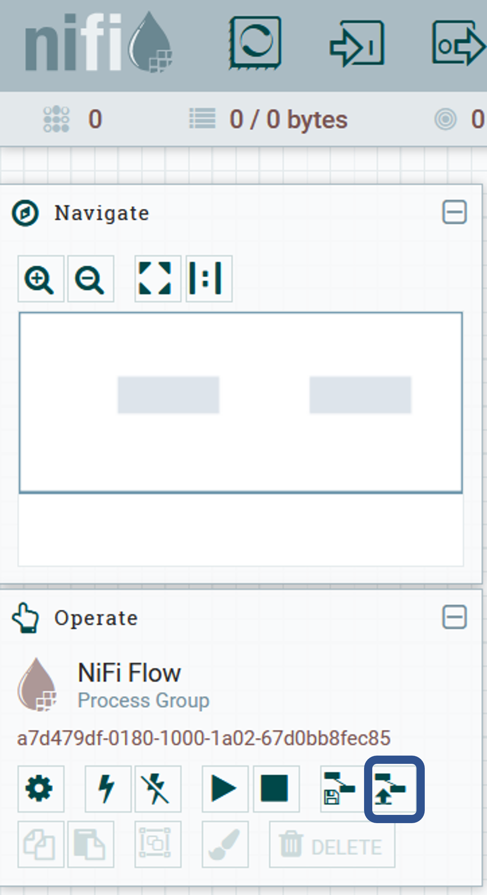

# VSDS-LDESDockers
Working docker environment for GIPOD LDES

## Initialization

Fill in the missing values (`MONGO_URL`, `MONGO_USERNAME` and , `MONGO_PASSWORD`) in the [docker-compose.yml](docker-compose.yml).

Initialize the environment by running `docker-compose up`

## Running the template

When the client is up an running, log in via the provided username and password. Then, import the template via the icon in the 'Operate' window.

Subsequently, load the template via the template icon in the menu bar.

Now both the `ReplicateLdesStream` and `POSTHttp` processors can be started.
